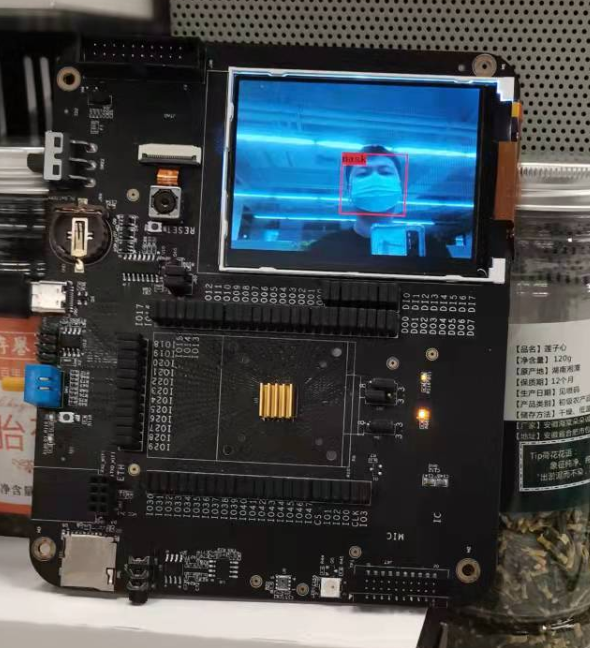
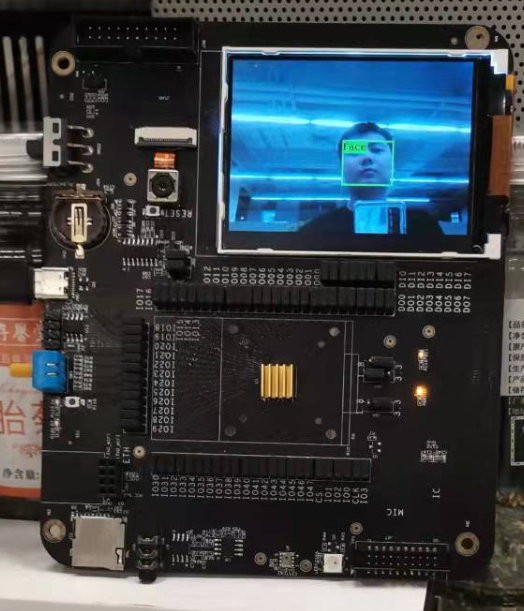

# K210 YOLO V3 mask-face 口罩检测模型

##### 这个模型经过二次修改，能跑通整个流程，但只是能用mobilenetv1和它的第二个检测头能检测到效果，踩了两天坑，训练了口罩检测模型

This is a clear, extensible yolo v3 framework

-   [x] Real-time display recall and precision
-   [x] Easy to use with other datasets
-   [x] Support multiple model backbones and expand more
-   [x] Support n number of output layers and m anchors
-   [x] Support model weight pruning
-   [x] Portable model to kendryte [K210](https://kendryte.com/) chip
# Training on mask-face

## Set Environment

Python 3.7.1`, Others in `requirements.txt`.

## Prepare dataset

first use [yolo](https://pjreddie.com/darknet/yolo/) scripts:

```sh
wget https://pjreddie.com/media/files/VOCtrainval_11-May-2012.tar
wget https://pjreddie.com/media/files/VOCtrainval_06-Nov-2007.tar
wget https://pjreddie.com/media/files/VOCtest_06-Nov-2007.tar
tar xf VOCtrainval_11-May-2012.tar
tar xf VOCtrainval_06-Nov-2007.tar
tar xf VOCtest_06-Nov-2007.tar
wget https://pjreddie.com/media/files/voc_label.py
python3 voc_label.py
cat 2007_train.txt 2007_val.txt 2012_*.txt > train.txt
```

now you have `train.txt`, then merge img path and annotation to one npy file:

```sh
python3 make_voc_list.py xxxx/train.txt data/voc_img_ann.npy
```

## Download pre-trian model

You **must** download the model weights you want to train because I load the pre-train weights by default. And put the files into `K210_Yolo_framework/data` directory. 

**My Demo use `yolo_mobilev1 0.75`**


| `MODEL`       | `DEPTHMUL` | Url                                                                                | Url                                        |
| ------------- | ---------- | ---------------------------------------------------------------------------------- | ------------------------------------------ |
| yolo_mobilev1 | 0.5        | [google drive](https://drive.google.com/open?id=1SmuqIU1uCLRgaePve9HgCj-SvXJB7U-I) | [weiyun](https://share.weiyun.com/59nnvtW) |
| yolo_mobilev1 | 0.75       | [google drive](https://drive.google.com/open?id=1BlH6va_plAEUnWBER6vij_Q_Gp8TFFaP) | [weiyun](https://share.weiyun.com/5FgNE0b) |
| yolo_mobilev1 | 1.0        | [google drive](https://drive.google.com/open?id=1vIuylSVshJ47aJV3gmoYyqxQ5Rz9FAkA) | [weiyun](https://share.weiyun.com/516LqR7) |
| yolo_mobilev2 | 0.5        | [google drive](https://drive.google.com/open?id=1qjpexl4dZLMtd0dX3QtoIHxXtidj993N) | [weiyun](https://share.weiyun.com/5BwaRTu) |
| yolo_mobilev2 | 0.75       | [google drive](https://drive.google.com/open?id=1qSM5iQDicscSg0MYfZfiIEFGkc3Xtlt1) | [weiyun](https://share.weiyun.com/5RRMwob) |
| yolo_mobilev2 | 1.0        | [google drive](https://drive.google.com/open?id=1Qms1BMVtT8DcXvBUFBTgTBtVxQc9r4BQ) | [weiyun](https://share.weiyun.com/5dUelqn) |
| tiny_yolo     |            | [google drive](https://drive.google.com/open?id=1M1ZUAFJ93WzDaHOtaa8MX015HdoE85LM) | [weiyun](https://share.weiyun.com/5413QWx) |
| yolo          |            | [google drive](https://drive.google.com/open?id=17eGV6DCaFQhVoxOuTUiwi7-v22DAwbXf) | [weiyun](https://share.weiyun.com/55g6zHl) |

**NOTE:** The mobilenet is not original, I have **modified it** to fit k210

## Train

```
python3 ./keras_train.py -h
```

## Inference

```
python3 keras_interface.py
```


## Prune Model

```sh
make train MODEL=xxxx MAXEP=1 ILR=0.0003 DATASET=voc CLSNUM=20 BATCH=16 PRUNE=True CKPT=log/xxxxxx/yolo_model.h5 END_EPOCH=1
```

When training finish, will save model as `log/xxxxxx/yolo_prune_model.h5`.


## Freeze

```sh
toco --output_file mobile_yolo.tflite --keras_model_file log/xxxxxx/yolo_model.h5
```
Now you have `mobile_yolo.tflite`

### Convert Kmodel

```
ncc_0.1_win\ncc test.tflite test.kmodel -i tflite -o k210model --dataset train_img
```

Please refer [nncase v0.1.0-RC5](https://github.com/kendryte/nncase/tree/v0.1.0-rc5) [example](https://github.com/kendryte/nncase/tree/v0.1.0-rc5/examples/20classes_yolo)


## 效果





